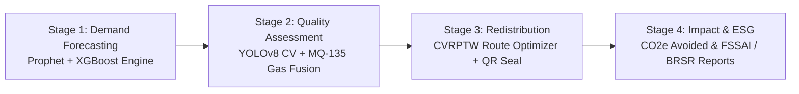

# 🍲 FoodSync: AI-Powered Smart Food Waste Reduction & Sustainable Redistribution Ecosystem

[](https://sih.gov.in)
[](https://mofpi.gov.in)
[](https://sih.gov.in)
[](LICENSE)

**Team Name:** FoodSync (Team ID: 144697)  
**Theme:** Agriculture, FoodTech & Rural Development  
**Category:** Software / AIoT  
**Organization:** Ministry of Food Processing Industries (MoFPI)

---

## 📌 Executive Summary

Globally, over **1.3 billion tonnes** of food are discarded annually (accounting for 8–10% of total greenhouse gas emissions). In India, institutional kitchens (hostels, universities, hospitals, corporate canteens) and food processing units suffer from:
1. **Source-Level Overproduction**: 15–28% excess cooking due to static headcount assumptions.
2. **Cold-Chain Blind Spots**: No real-time spoilage tracking leading to premature disposal or delayed donations.
3. **Siloed Redistribution Logistics**: Fragmented communication between donor kitchens, NGOs, and shelters.

**FoodSync** provides an end-to-end AIoT ecosystem that executes four synchronized stages:
`Predict Demand (Pre-Cooking)` ➔ `Verify Freshness (Vision + Gas IoT)` ➔ `Route Surplus (Shelf-Life VRP)` ➔ `Report Impact (Automated ESG)`.

---

## 🌟 The 4-Stage Core Architecture



### 1. 🧠 Stage 1: Demand Intelligence & Batch Sizing
- **Algorithms:** Prophet time-series + XGBoost regression.
- **Data Ingestion:** POS attendance, academic calendars, festival dates, and real-time weather.
- **Output:** Raw-material procurement quotas (Rice, Dal, Vegetables, Cooking Oil) to eliminate overproduction before cooking starts.

### 2. 👁️ Stage 2: Quality Assessment & Safe Consumption Window (SCW)
- **Multi-Sensor Fusion:** Edge computer vision (YOLOv8) + ambient gas telemetry ($NH_3$ ammonia, $CO_2$, temperature, humidity).
- **Output:** Verified **Safe Consumption Window (SCW)** in hours. Safe surplus is routed to shelters; degraded batches are diverted to biogas/compost.

### 3. 🚚 Stage 3: Perishability-Aware Dynamic Redistribution
- **Routing Engine:** Google OR-Tools Capacitated Vehicle Routing Problem with Time Windows (CVRPTW).
- **Logistics:** Dispatches prioritized by decaying shelf-life windows and live traffic congestion (<45 min transit limit).
- **Digital Seal:** Dynamic QR code verification with mandatory thermal gate check.

### 4. 🌱 Stage 4: Automated ESG Analytics & Reporting
- **Carbon Accounting:** $2.5	ext{ kg } CO_2e$ avoided per kg food diverted.
- **Compliance:** Instant audit exports formatted for **FSSAI "Save Food Share Food" (2019)**, **SEBI BRSR Core**, and **NAAC Green Campus** metrics.

---

## 📊 Proposed Targets & Impact

| Metric | Target |
|---|---|
| **Raw Material Wastage Reduction** | **35–50%** lower waste in institutional kitchens within 60 days |
| **Monthly Procurement Cost Savings** | **18%** lower purchasing costs via ingredient batch optimization |
| **Greenhouse Gas Emissions Avoidance** | **2.5 kg CO₂e** avoided per kg of edible food diverted |
| **Forecast Precision & SCW Accuracy** | **>92%** precision; **94.2%** SCW prediction vs lab assays |

---

## 🛠️ Technology Stack

- **AI & Forecasting:** Python, Prophet, XGBoost, Scikit-learn
- **Computer Vision & IoT:** YOLOv8, OpenCV, ESP32, MQ-135 ($NH_3$), MQ-4 ($CO_2$), DHT22
- **Logistics & Routing:** Google OR-Tools (CVRPTW), Leaflet / OpenStreetMap
- **Full-Stack Application:** Node.js, Express.js REST APIs, Chart.js, QRCode.js, HTML5/CSS3

---

## 🚀 Getting Started & Local Setup

### Prerequisites
- Node.js (v18+)
- Python (3.9+)

### Installation

1. **Clone the repository:**
   ```bash
   git clone https://github.com/gauri2-java/foodsync-ai-food-waste-reduction.git
   cd foodsync-ai-food-waste-reduction
   ```

2. **Install Node.js dependencies:**
   ```bash
   npm install
   ```

3. **Start the Full-Stack Server:**
   ```bash
   npm start
   ```
   Access the dashboard at: `http://localhost:5000`

4. **(Optional) Run AI Inference Simulation Scripts:**
   ```bash
   python ai-models/forecast_model.py
   python ai-models/yolov8_freshness_classifier.py
   python ai-models/route_optimizer_ortools.py
   ```

---

## 👥 Team FoodSync
- **Team ID:** 144697
- **Submission:** Smart India Hackathon 2026 (SIH 2026)
- **Ministry:** Ministry of Food Processing Industries (MoFPI)

## 📄 License
This project is licensed under the MIT License.
